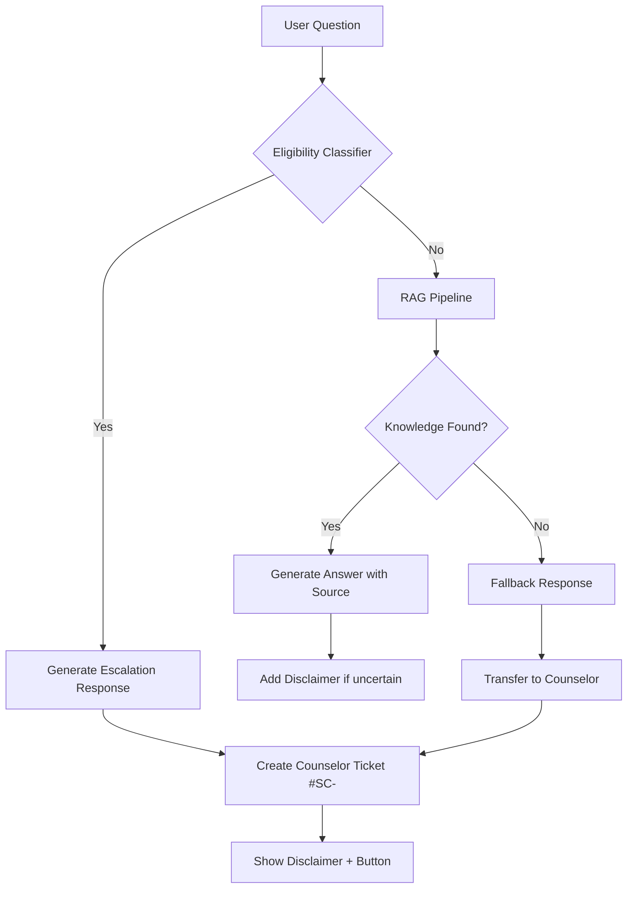

# demo.md — Demo kiến trúc dữ liệu

File này minh họa pipeline mới với eligibility classifier.

---

## 1. Sơ đồ cách hệ thống xử lý



**Legend**:
- **Eligibility Classifier**: Rule-based module (keywords + intent)
- **RAG Pipeline**: Retrieve từ knowledge base chính thức
- **Escalation Response**: Canned response "Tôi không thể đánh giá eligibility..."
- **Fallback Response**: "Thông tin chưa có, vui lòng chat counselor"

---

## 2. Thành phần chính

| Thành phần | Nhận gì? | Làm gì? | Trả ra gì? |
|---|---|---|---|
| Eligibility Classifier | Câu hỏi user | Phát hiện trigger keywords + intent classification | Decision: "escalate" / "continue" |
| Knowledge Base (RAG) | Question (nếu không escalate) | Tra cứu nguồn chính thức | Thông tin + URL nguồn |
| Response Generator | Question + Knowledge | Tạo câu trả lời | Answer text + source attribution |
| Escalation Handler | Escalate signal | Tạo ticket, gửi thông báo | Ticket #SC- + counselor notification |
| Audit Logger | Mọi input/output | Ghi log: question, classification, action | Log entry cho monitoring |

---

## 3. Khi hệ thống gặp vấn đề

| Khi nào lỗi xảy ra? | Hệ thống làm gì? | Người dùng thấy gì? | Log để monitor? |
|---|---|---|---|
| Nguồn chính thức không có dữ liệu | Fallback → Escalate | "Thông tin chưa có, tôi sẽ chuyển cho counselor." | ✅ Logged as "no_source" |
| Nguồn bị lỗi hoặc quá chậm | Timeout → Escalate | "Hệ thống đang cập nhật, tôi sẽ chuyển bạn cho counselor." | ✅ Logged as "source_error" |
| Câu hỏi vượt phạm vi (prompt injection) | Classifier detect → Escalate | "Câu hỏi này vượt phạm vi, tôi sẽ chuyển cho counselor." | ✅ Logged as "out_of_scope" |
| Lỗi này lặp lại nhiều lần | Alert sent to admin | (Không ảnh hưởng user) | ✅ Dashboard trigger |

---

## 4. Kiểm tra nhanh

- [x] Sơ đồ không chỉ là "AI trả lời tốt hơn", mà có bước kiểm tra cụ thể (classifier).
- [x] Có cách xử lý khi không có dữ liệu (fallback → escalate).
- [x] Có cách chuyển sang người thật (ticket system).
- [x] Có cách theo dõi để lần sau sửa tốt hơn (audit log + monitoring).

---

## 5. Monitoring Dashboard (optional)

```text
+---------------------------------------------------+
| Real-time Eligibility Escalation Monitor         |
+---------------------------------------------------+
| Total questions (24h): 1,234                     |
| Escalated: 156 (12.7%)                           |
|  - Eligibility: 89                               |
|  - Out of scope: 23                              |
|  - No source: 44                                 |
|                                                   |
| Top trigger keywords:                            |
| 1. "đủ điều kiện" (45 hits)                      |
| 2. "có được không" (28 hits)                     |
| 3. "khả năng" (12 hits)                          |
|                                                   |
| Alert: No source for "học bổng A" > 3 days       |
+---------------------------------------------------+
```
